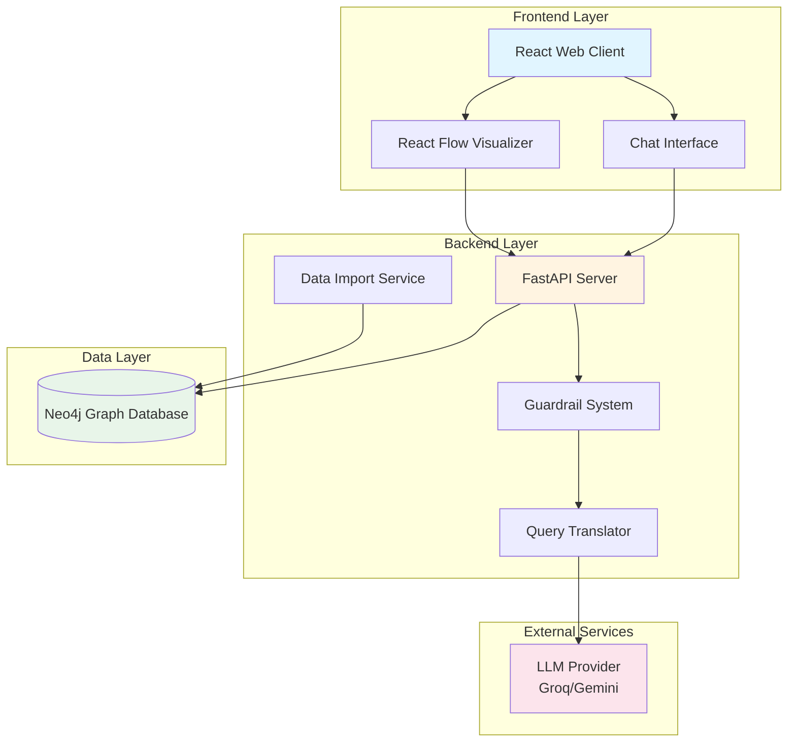

# Design Document: Graph-Based Data Modeling and Query System

## Overview

The Graph-Based Data Modeling and Query System is a full-stack application that transforms fragmented relational business data into a unified graph representation, enabling intuitive exploration through interactive visualization and natural language querying. The system consists of three primary layers:

1. **Data Layer**: Neo4j graph database storing business entities (Orders, Deliveries, Invoices, Payments, Customers, Products, Addresses) as nodes with typed relationships
2. **Backend Layer**: Python FastAPI service handling data import, query translation, and database operations
3. **Frontend Layer**: React + Vite application with React Flow visualization and conversational chat interface

The system leverages LLM technology (Groq or Gemini free tier) to translate natural language questions into Cypher queries, making graph querying accessible to non-technical business analysts. A guardrail system ensures queries remain within the business intelligence domain.

### Key Design Decisions

**Graph Database Choice**: Neo4j was selected for its mature Cypher query language, excellent performance on relationship traversals, and robust Python driver support.

**LLM Integration Strategy**: Using external LLM providers (Groq/Gemini) rather than self-hosted models reduces infrastructure complexity and leverages state-of-the-art language understanding. The system uses few-shot prompting with schema context to guide query generation.

**Guardrail Implementation**: Pre-translation intent classification prevents misuse and reduces LLM API costs by rejecting out-of-domain queries before expensive translation.

**Visualization Library**: React Flow provides a production-ready graph visualization component with built-in interactivity, reducing custom development effort.

## Architecture

### System Architecture Diagram



### Component Interaction Flow

**Query Processing Flow**:
1. User enters natural language query in Chat Interface
2. Frontend sends query to `/api/query` endpoint
3. Guardrail System classifies query intent (in-domain vs out-of-domain)
4. If in-domain, Query Translator sends query + schema context to LLM
5. LLM returns Cypher query
6. Query Translator validates Cypher syntax
7. API Server executes Cypher against Neo4j
8. Results formatted as JSON and returned to frontend
9. Chat Interface displays results in conversation

**Data Import Flow**:
1. User uploads CSV/JSON file via `/api/import` endpoint
2. Data Import Service validates file format and required fields
3. Service creates nodes for each business entity
4. Service establishes relationships based on foreign keys
5. Returns success status with entity/relationship counts

**Visualization Flow**:
1. Frontend requests graph data from `/api/graph` endpoint
2. API Server queries Neo4j for nodes and relationships
3. Data transformed to React Flow format (nodes, edges)
4. Graph Visualizer renders interactive graph
5. User interactions (click, drag, zoom) handled client-side

### Technology Stack

**Backend**:
- Python 3.11+
- FastAPI (async web framework)
- Neo4j Python Driver (database connectivity)
- Pydantic (data validation)
- httpx (LLM API requests)

**Frontend**:
- React 18
- Vite (build tool)
- React Flow (graph visualization)
- Axios (HTTP client)
- TailwindCSS (styling)

**Database**:
- Neo4j 5.x (graph database)

**External Services**:
- Groq API or Google Gemini API (LLM provider)

## Components and Interfaces

### Backend Components

#### 1. FastAPI Server (`main.py`)

Main application entry point exposing REST API endpoints.

**Endpoints**:

```python
POST /api/query
Request: {
    "query": str,  # Natural language query
    "conversation_id": Optional[str],  # For context tracking
    "include_cypher": Optional[bool]  # Show generated Cypher
}
Response: {
    "success": bool,
    "data": List[Dict],  # Query results
    "cypher": Optional[str],  # Generated Cypher if requested
    "error": Optional[str],
    "node_ids": Optional[List[str]]  # For highlighting
}

GET /api/graph?limit=100
Response: {
    "nodes": List[{
        "id": str,
        "label": str,  # Entity type
        "properties": Dict
    }],
    "edges": List[{
        "id": str,
        "source": str,
        "target": str,
        "type": str,  # Relationship type
        "properties": Dict
    }]
}

POST /api/import
Request: multipart/form-data with file
Response: {
    "success": bool,
    "nodes_created": int,
    "relationships_created": int,
    "errors": Optional[List[str]]
}

GET /api/schema
Response: {
    "node_types": List[{
        "label": str,
        "properties": List[str]
    }],
    "relationship_types": List[str]
}

GET /api/health
Response: {
    "status": str,
    "neo4j_connected": bool,
    "llm_provider": str
}
```

**Dependencies**: GuardrailSystem, QueryTranslator, Neo4jService, DataImportService

#### 2. Guardrail System (`guardrails.py`)

Validates that queries are within the business intelligence domain.

**Interface**:
```python
class GuardrailSystem:
    def classify_query(self, query: str) -> QueryClassification:
        """
        Classifies query as in-domain or out-of-domain.
        
        Returns:
            QueryClassification with fields:
            - is_valid: bool
            - reason: Optional[str]  # Rejection reason if invalid
        """
        pass
```

**Implementation Strategy**:
- Keyword-based classification using domain vocabulary
- Check for business entity mentions (Order, Delivery, Invoice, Payment, Customer, Product, Address)
- Check for business process terms (billing, shipping, payment, flow, trace)
- Reject queries containing off-topic keywords (weather, sports, personal advice, general knowledge)
- Optional: Use lightweight LLM call for ambiguous cases

#### 3. Query Translator (`query_translator.py`)

Converts natural language to Cypher queries using LLM.

**Interface**:
```python
class QueryTranslator:
    def __init__(self, llm_provider: str, api_key: str, schema: GraphSchema):
        pass
    
    def translate(self, natural_language_query: str) -> TranslationResult:
        """
        Translates natural language to Cypher query.
        
        Returns:
            TranslationResult with fields:
            - cypher: str
            - success: bool
            - error: Optional[str]
        """
        pass
    
    def _build_prompt(self, query: str) -> str:
        """Constructs LLM prompt with schema and examples."""
        pass
    
    def _validate_cypher(self, cypher: str) -> bool:
        """Basic syntax validation for generated Cypher."""
        pass
```

**Prompt Engineering Strategy**:
- Include complete graph schema (node types, properties, relationship types)
- Provide 5-10 example query translations covering common patterns
- Instruct LLM to return only Cypher code without explanations
- Include constraints (e.g., "LIMIT results to 20 by default")
- Specify error handling (e.g., "Use OPTIONAL MATCH for potentially missing relationships")

**Example Prompt Structure**:
```
You are a Cypher query generator for a business intelligence graph database.

SCHEMA:
Nodes: Order(order_id, customer_id, order_date, total_amount, status)
       Delivery(delivery_id, order_id, delivery_date, status, tracking_number)
       Invoice(invoice_id, order_id, invoice_date, amount, status)
       Payment(payment_id, invoice_id, payment_date, amount, payment_method)
       Customer(customer_id, name, email, phone, address_id)
       Product(product_id, name, category, price, sku)
       Address(address_id, street, city, state, postal_code, country)

Relationships: (Order)-[:DELIVERED_BY]->(Delivery)
               (Order)-[:BILLED_BY]->(Invoice)
               (Invoice)-[:PAID_BY]->(Payment)
               (Order)-[:PURCHASED_BY]->(Customer)
               (Order)-[:SHIPS_TO]->(Address)
               (Order)-[:CONTAINS]->(Product)

EXAMPLES:
Q: "Show me the top 10 products by number of orders"
A: MATCH (p:Product)<-[:CONTAINS]-(o:Order) RETURN p.name, p.product_id, COUNT(o) AS order_count ORDER BY order_count DESC LIMIT 10

Q: "Find orders that have been delivered but not invoiced"
A: MATCH (o:Order)-[:DELIVERED_BY]->(d:Delivery) WHERE NOT EXISTS((o)-[:BILLED_BY]->(:Invoice)) RETURN o.order_id, o.order_date, d.delivery_date

Q: "Trace the complete flow for order 12345"
A: MATCH path = (o:Order {order_id: '12345'})-[:DELIVERED_BY]->(d:Delivery), (o)-[:BILLED_BY]->(i:Invoice)-[:PAID_BY]->(p:Payment) RETURN o, d, i, p

USER QUERY: {natural_language_query}

Return only the Cypher query without explanation.
```

#### 4. Neo4j Service (`neo4j_service.py`)

Handles all database operations.

**Interface**:
```python
class Neo4jService:
    def __init__(self, uri: str, user: str, password: str):
        pass
    
    def execute_query(self, cypher: str, parameters: Dict = None) -> List[Dict]:
        """Executes Cypher query and returns results."""
        pass
    
    def get_graph_data(self, limit: int = 100) -> GraphData:
        """Retrieves nodes and relationships for visualization."""
        pass
    
    def create_node(self, label: str, properties: Dict) -> str:
        """Creates a node and returns its ID."""
        pass
    
    def create_relationship(self, source_id: str, target_id: str, 
                          rel_type: str, properties: Dict = None) -> str:
        """Creates a relationship between nodes."""
        pass
    
    def health_check(self) -> bool:
        """Verifies database connectivity."""
        pass
```

#### 5. Data Import Service (`data_import.py`)

Processes uploaded files and populates the graph database.

**Interface**:
```python
class DataImportService:
    def __init__(self, neo4j_service: Neo4jService):
        pass
    
    def import_file(self, file_path: str, file_type: str) -> ImportResult:
        """
        Imports business data from CSV or JSON file.
        
        Returns:
            ImportResult with fields:
            - success: bool
            - nodes_created: int
            - relationships_created: int
            - errors: List[str]
        """
        pass
    
    def _validate_data(self, data: List[Dict], entity_type: str) -> ValidationResult:
        """Validates required fields for entity type."""
        pass
    
    def _infer_relationships(self, entities: Dict[str, List[Dict]]) -> List[Relationship]:
        """Infers relationships from foreign key references."""
        pass
```

**Data Validation Rules**:
- Orders: require order_id, customer_id, order_date
- Deliveries: require delivery_id, order_id, delivery_date
- Invoices: require invoice_id, order_id, invoice_date, amount
- Payments: require payment_id, invoice_id, payment_date, amount
- Customers: require customer_id, name
- Products: require product_id, name, price
- Addresses: require address_id, city, country

### Frontend Components

#### 1. App Component (`App.tsx`)

Root component managing application state and routing.

**State**:
- `graphData`: Nodes and edges for visualization
- `conversationHistory`: Chat messages
- `selectedNode`: Currently selected node details
- `loading`: Loading states for async operations

#### 2. Chat Interface (`ChatInterface.tsx`)

Conversational UI for natural language queries.

**Props**:
```typescript
interface ChatInterfaceProps {
    onQuerySubmit: (query: string) => Promise<QueryResponse>;
    conversationHistory: Message[];
    loading: boolean;
}

interface Message {
    id: string;
    type: 'user' | 'assistant';
    content: string;
    timestamp: Date;
    cypher?: string;  // Optional generated Cypher
    data?: any[];  // Optional query results
}
```

**Features**:
- Text input with submit button
- Message history display
- Loading indicators
- Error message display
- Optional Cypher query expansion
- Result formatting (tables for structured data)

#### 3. Graph Visualizer (`GraphVisualizer.tsx`)

Interactive graph visualization using React Flow.

**Props**:
```typescript
interface GraphVisualizerProps {
    nodes: Node[];
    edges: Edge[];
    onNodeClick: (node: Node) => void;
    onEdgeClick: (edge: Edge) => void;
    highlightedNodeIds?: string[];
}

interface Node {
    id: string;
    type: string;  // Entity type
    data: {
        label: string;
        properties: Record<string, any>;
    };
    position: { x: number; y: number };
}

interface Edge {
    id: string;
    source: string;
    target: string;
    type: string;  // Relationship type
    label: string;
}
```

**Visual Styling**:
- Distinct colors per node type (Order: blue, Delivery: green, Invoice: orange, Payment: purple, Customer: pink, Product: yellow, Address: gray)
- Edge labels showing relationship types
- Highlighted nodes with thicker borders and glow effect
- Automatic layout using force-directed algorithm for large graphs

#### 4. Node Detail Panel (`NodeDetailPanel.tsx`)

Displays properties of selected node or edge.

**Props**:
```typescript
interface NodeDetailPanelProps {
    selectedItem: Node | Edge | null;
    onClose: () => void;
}
```

**Display Format**:
- Entity type header
- Property list (key-value pairs)
- Related entities count
- Action buttons (e.g., "Trace Flow", "Find Related")

## Data Models

### Graph Schema

#### Node Types

**Order**
```
Properties:
- order_id: String (unique identifier)
- customer_id: String (foreign key)
- order_date: DateTime
- total_amount: Float
- status: String (enum: pending, confirmed, shipped, delivered, cancelled)
```

**Delivery**
```
Properties:
- delivery_id: String (unique identifier)
- order_id: String (foreign key)
- delivery_date: DateTime
- status: String (enum: scheduled, in_transit, delivered, failed)
- tracking_number: String
```

**Invoice**
```
Properties:
- invoice_id: String (unique identifier)
- order_id: String (foreign key)
- invoice_date: DateTime
- amount: Float
- status: String (enum: draft, sent, paid, overdue, cancelled)
```

**Payment**
```
Properties:
- payment_id: String (unique identifier)
- invoice_id: String (foreign key)
- payment_date: DateTime
- amount: Float
- payment_method: String (enum: credit_card, debit_card, bank_transfer, cash)
```

**Customer**
```
Properties:
- customer_id: String (unique identifier)
- name: String
- email: String
- phone: String
- address_id: String (foreign key)
```

**Product**
```
Properties:
- product_id: String (unique identifier)
- name: String
- category: String
- price: Float
- sku: String
```

**Address**
```
Properties:
- address_id: String (unique identifier)
- street: String
- city: String
- state: String
- postal_code: String
- country: String
```

#### Relationship Types

**DELIVERED_BY**
- Source: Order
- Target: Delivery
- Properties: None
- Cardinality: One-to-One

**BILLED_BY**
- Source: Order
- Target: Invoice
- Properties: None
- Cardinality: One-to-Many (orders can have multiple invoices)

**PAID_BY**
- Source: Invoice
- Target: Payment
- Properties: None
- Cardinality: One-to-Many (invoices can have multiple payments)

**PURCHASED_BY**
- Source: Order
- Target: Customer
- Properties: None
- Cardinality: Many-to-One

**SHIPS_TO**
- Source: Order
- Target: Address
- Properties: None
- Cardinality: Many-to-One

**CONTAINS**
- Source: Order
- Target: Product
- Properties:
  - quantity: Integer
  - unit_price: Float
- Cardinality: Many-to-Many

**INCLUDES_PRODUCT**
- Source: Invoice
- Target: Product
- Properties:
  - quantity: Integer
  - unit_price: Float
- Cardinality: Many-to-Many

### API Data Models

**QueryRequest**
```python
class QueryRequest(BaseModel):
    query: str
    conversation_id: Optional[str] = None
    include_cypher: Optional[bool] = False
```

**QueryResponse**
```python
class QueryResponse(BaseModel):
    success: bool
    data: List[Dict[str, Any]]
    cypher: Optional[str] = None
    error: Optional[str] = None
    node_ids: Optional[List[str]] = None
```

**ImportRequest**
```python
# Handled as multipart/form-data file upload
```

**ImportResponse**
```python
class ImportResponse(BaseModel):
    success: bool
    nodes_created: int
    relationships_created: int
    errors: Optional[List[str]] = None
```

**GraphData**
```python
class GraphNode(BaseModel):
    id: str
    label: str
    properties: Dict[str, Any]

class GraphEdge(BaseModel):
    id: str
    source: str
    target: str
    type: str
    properties: Dict[str, Any]

class GraphData(BaseModel):
    nodes: List[GraphNode]
    edges: List[GraphEdge]
```

